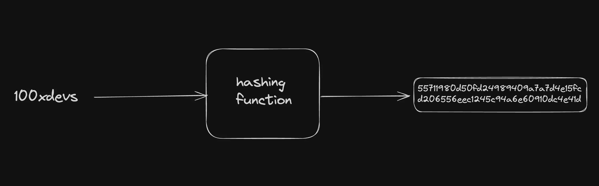

# Understanding Hashing

## What is Hashing?

Hashing is a process that transforms input data of any size into a fixed-size string of characters. This output string is called a hash value or hash digest.



## Essential Properties of Hash Functions

1. **Deterministic**

   - The same input will always produce the same output
   - This property ensures consistency and reliability

2. **Fast Computation**

   - Hash values can be quickly computed for any given input
   - Efficient processing is crucial for practical applications

3. **Pre-image Resistance**

   - It should be computationally infeasible to reverse the hash
   - You cannot determine the original input just by looking at the hash

4. **Avalanche Effect**

   - Small changes in input produce large changes in output
   - Even a single bit change should result in a significantly different hash

5. **Collision Resistance**
   - It should be extremely difficult to find two different inputs that produce the same hash
   - This property is crucial for security applications

## Analysis: Alphabet Increment Method

The proposed method of "incrementing each alphabet by one" (e.g., 'hello' → 'ifmmp') is NOT a proper hash function. Here's why:

❌ **Not Fixed-Size Output**

- The output length varies with input length
- True hash functions produce fixed-length output regardless of input size

❌ **No Pre-image Resistance**

- Easy to reverse: simply decrease each letter by one
- True hash functions should be practically impossible to reverse

❌ **Poor Avalanche Effect**

- Small input changes produce small, predictable output changes
- True hash functions produce drastically different outputs for similar inputs

❌ **Weak Collision Resistance**

- Easy to find collisions by using non-alphabet characters
- True hash functions make finding collisions computationally infeasible

✅ **Only Meets:**

- Deterministic (same input always produces same output)
- Fast computation

## Better Alternatives

For proper hashing, use established algorithms like:

- SHA-256
- MD5 (not for security purposes)
- bcrypt (for password hashing)
- Keccak (used in Ethereum)

## Proof of Work (PoW)

Proof of Work is a consensus mechanism used in blockchain networks that requires computational effort to validate transactions and create new blocks.

In shorter terms, the stating of a problem and finding a solution(nonce) to it is called PoW. Then it brodcasted to the network.

### How PoW Works

1. **The Challenge**

   - Miners must find a nonce (number) that, when combined with block data
   - When hashed, produces a result meeting specific criteria (like starting with a certain number of zeros)

2. **Mining Process**

   - Hash(block data + nonce) must be less than target value
   - Miners repeatedly try different nonces until they find a valid solution
   - First miner to find valid solution gets to add block and receive rewards

3. **Difficulty Adjustment**
   - Network automatically adjusts difficulty to maintain consistent block time
   - More mining power = harder target value
   - Less mining power = easier target value

### Key Properties

1. **Asymmetric**

   - Hard to find solution (requires many attempts)
   - Easy to verify solution (single hash operation)

2. **Adjustable Difficulty**

   - Can be tuned to network conditions
   - Maintains consistent block times

3. **Resource Intensive**
   - Requires significant computational power
   - Energy consumption is a major consideration

### Example

```
Block Data: "transactions_data"
Target: Hash must start with "0000"

Attempt 1:
nonce = 1
Hash("transactions_data1") = "1a2b3c..." ❌

Attempt 2:
nonce = 2
Hash("transactions_data2") = "0000ef..." ✅ Valid!
```

### Real-World Applications

- Bitcoin mining
- Ethereum (pre-merge)
- Protection against spam and DDoS attacks
- Email spam prevention (Hashcash)
